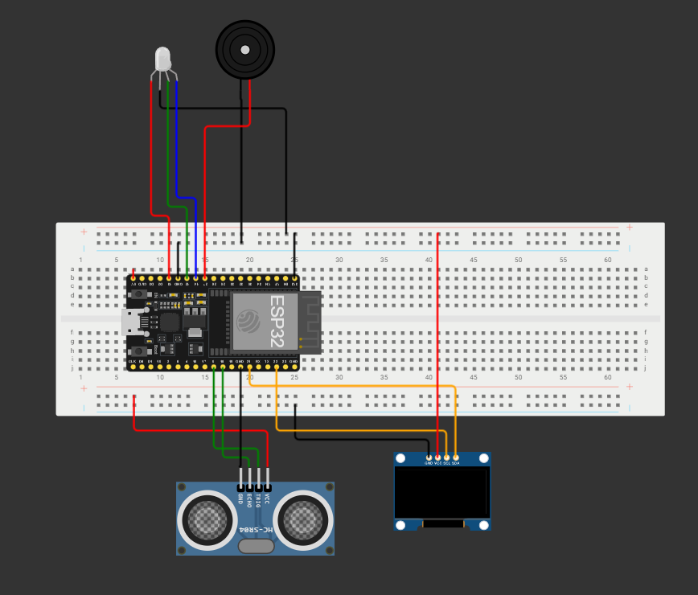

# Processo Seletivo – Intensivo Maker | IoT
## Etapa Prática – Sistemas Embarcados

## 📝 Relatório do Candidato

## Nome do Projeto: 

### 👤 Identificação do Candidato

- **Nome completo:** Antonio Rafael Oliveira da Cunha
- **GitHub:** https://github.com/devraffa

---

## 1️⃣ Visão Geral da Solução

- **Qual é o objetivo do seu projeto:** Desenvolver um sistema embarcado IoT de baixo custo focado na segurança ocupacional e na otimização logística de plantas industriais. O projeto atua na prevenção de colisões envolvendo maquinário autônomo (como robôs), máquinas pesadas de cargas, esteiras de produto e operadores humanos. A motivação nasce da necessidade de mitigar acidentes físicos em fábricas, onde a ideia surgiu de um relato de um conhecido que trabalhava em uma fábrica e presenciou um acidente com máquinas. O diferencial da solução é oferecer às empresas uma ferramenta dupla: ela atua ativamente na prevenção de impactos iminentes e, simultaneamente, atua como um coletor de dados analíticos para que a gestão possa reestruturar o layout, melhorar a sinalização e otimizar a produtividade nos pontos de maior congestionamento e risco.
- **O que o sistema embarcado simulado faz:** O sistema realiza o monitoramento contínuo do perímetro utilizando um sensor ultrassônico, dividindo o espaço em zonas de risco escalonadas. Ao detectar uma invasão na "Zona de Atenção", o microcontrolador inicia um processo de telemetria, gravando logs detalhados (estado e distância) no sistema de arquivos. Esses registros de quase-acidentes são fundamentais para auditorias de segurança. Caso a aproximação evolua para a "Zona de Perigo", o sistema aciona imediatamente uma rotina de emergência com atuadores de resposta rápida, disparando alertas visuais (LED de status) e sonoros (Buzzer em PWM) para forçar a parada da máquina ou o recuo do colaborador.
- **Como o usuário interage com ele (se aplicável):** A interação ocorre em duas frentes. No deposito da fábrica, podendo ser colocado em parades ou até mesmo no chão (Operacional): A interação é em tempo real. O operador ou veículo ao entrar no raio de detecção interage passivamente com o sensor, e recebe o feedback imediato do ambiente através do Display OLED (que atua como uma IHM - Interface Homem-Máquina) e dos alarmes sensoriais (LED e Buzzer). Na gestão (Analítica): Engenheiros de segurança e gestores interagem de forma assíncrona consumindo o arquivo eventos.log, analisando as métricas de distância crítica para tomada de decisão preventiva.

---

## 2️⃣ Arquitetura do Sistema Embarcado

A arquitetura do firmware foi projetada sob o paradigma de programação não-bloqueante e orientada a eventos de tempo, simulando um scheduler cooperativo. Isso garante que o microcontrolador mantenha alta responsividade, executando múltiplas tarefas (coleta de telemetria, renderização de interface e gravação de disco) sem que o processador "congele".

Fluxo Principal (main.py): O ciclo de vida do software é estruturado em duas fases:

Setup: Configuração inicial dos barramentos de hardware (I2C a 400kHz para o OLED), instanciação dos pinos físicos (GPIO para HC-SR04 e LEDs RGB) e inicialização do PWM (Buzzer).

Loop de Telemetria: O sistema opera em um ciclo contínuo. Em vez de usar delays procedurais, o firmware utiliza polling de tempo (time.ticks_ms()) para disparar a função de leitura a cada 100ms estritos.

Estrutura de Estados e Temporizações: A inteligência do radar é controlada por uma Máquina de Estados Finita. O sistema transita entre quatro estados determinísticos com base na distância aferida:

ESTADO_INATIVO (Standby): Distâncias < 0 ou > 150cm. O sistema desliga atuadores visuais e sonoros para conservação máxima de energia.

ESTADO_SEGURO (Zona Verde): > 60cm. Condição nominal de operação.

ESTADO_ATENÇÃO (Zona Amarela): Entre 20cm e 60cm. O risco aumenta, o LED sinaliza a cor amarela e o microcontrolador inicia o registro de logs de segurança em memória flash.

ESTADO_PERIGO (Zona Vermelha): <= 20cm. Aciona-se a sirene PWM a 1000Hz (Buzzer) simultaneamente à indicação vermelha e aos registros críticos de log.

Otimização de Renderização (Anti-Flickering): Para não sobrecarregar o barramento I2C, foi criada uma trava lógica (precisa_atualizar_tela), garantindo que o display OLED só seja redesenhado se a distância sofrer uma variação maior que 0.5cm ou se o estado nominal mudar.

Gestão de Dados e Logs: O sistema atua como um buffer de borda. Quando um evento de risco ocorre (Atenção ou Perigo), os dados são estruturados e persistidos no arquivo eventos.log. Essa formatação padronizada e descentralizada prepara o terreno para uma futura escalabilidade da arquitetura de backend, permitindo fácil ingestão desses dados por serviços de mensageria na nuvem ou sistemas distribuídos de processamento em tempo real.

graph TD
    
    %% Entradas
    A([⏱️ Loop 100ms]) --> B[Sensor HC-SR04]
    B -->|Retorna Distância| C{Máquina de Estados}
    
    %% Processamento
    C -->|Dist > 60| D(SEGURO)
    C -->|20 < Dist <= 60| E(ATENÇÃO)
    C -->|Dist <= 20| F(PERIGO)
    C -->|Inválido/Longe| G(INATIVO)
    
    %% Saídas de Hardware
    D -->|LED Verde| H[Atuadores GPIO]
    E -->|LED Amarelo| H
    F -->|LED Vermelho + Buzzer PWM| H
    G -->|Desliga Tudo| H
    
    %% Saídas de Software e IHM
    H --> I[Filtro Anti-Flickering]
    I -->|> 0.5cm de variação| J[Display OLED SSD1306]
    E -.->|Grava Risco Local| K[(eventos.log)]
    F -.->|Grava Acidente Local| K

---

## 3️⃣ Componentes Utilizados na Simulação

*> Representação visual do circuito montado no simulador Wokwi.*

| Componente | Função no Sistema | Conexão ESP32 |
| :--- | :--- | :--- |
| **ESP32 DevKit V4** | Unidade de Processamento Central, controle da FSM e gravação de logs. | - |
| **Sensor Ultrassônico (HC-SR04)** | Telemetria espacial (medição de distância do obstáculo). | GPIO 5 (TRIG) GPIO 18 (ECHO) |
| **LED RGB (Ânodo Comum)** | Sinalização visual escalonada de zonas de risco (Verde, Amarelo, Vermelho). | GPIO 13 (RED) GPIO 12 (GREEN) GPIO 14 (BLUE) |
| **Buzzer** | Sirene de alerta de emergência acionada via PWM (1000Hz). | GPIO 27 |
| **Display OLED (SSD1306)** | Interface Homem-Máquina (IHM) para exibição de status e distância em tempo real. | I2C 0 GPIO 21 (SDA) GPIO 22 (SCL) |

- ESP32: Recebe a informação da distância, pensa rápido para decidir o nível de perigo, manda ligar/desligar as luzes e a sirene, e ainda anota os "quase-acidentes" no arquivo de log.
- Sensor HC-SR04: Emite um pulso de som e conta quanto tempo esse som demora para bater em um obstáculo e voltar. Com base nesse tempo de "bate e volta", ele avisa para o ESP32 exatamente a qual distância o objeto está.
- LED RGB: Ele traduz o risco do ambiente em cores instintivas.
- Buzzer: Quando o LED fica vermelho (distância crítica), o buzzer começa a pulsar o som para forçar o operador a parar a máquina ou se afastar, evitando o acidente físico.
- Display OLED: Enquanto o LED dá o alerta rápido, o display mostra os dados matemáticos da operação: o nome do status em que a máquina está e a distância exata do obstáculo em centímetros.
---

## 4️⃣ Decisões Técnicas Relevantes

- **Arquitetura Modular e Resolução de Conflitos no Docker:** O projeto foi estruturado com forte foco em modularidade. A biblioteca do display (ssd1306.py) e os scripts auxiliares foram mantidos dentro da pasta src/, junto ao núcleo de execução (main.py). Para viabilizar essa arquitetura limpa no pipeline de testes automatizados do Wokwi (que nativamente procura arquivos na raiz), foi necessário realizar uma mudança no Dockerfile do projeto. A instrução de montagem da imagem foi refatorada para cp src/*.py ~/fs/, garantindo que o sistema de arquivos (fs.bin) do ESP32 fosse compilado com todos os módulos juntos, resolvendo erros de importação sem sacrificar a organização do repositório.
- **Temporização Não-Bloqueante na Máquina de Estados:** O uso de funções de atraso (time.sleep()) foi estritamente limitado à fase de boot do sistema e às rotinas de simulação de CI/CD. O ciclo contínuo de monitoramento (o loop principal) não possui bloqueios, sendo regido por temporizadores assíncronos (time.ticks_diff()) que operam a 10Hz (100ms). Os únicos atrasos procedurais mantidos na regra de negócio foram os de nível de microssegundo (sleep_us) na função ler_distancia(), que são uma exigência física inflexível para engatilhar o pulso sonoro do componente HC-SR04.
- **Otimização de Barramento I2C (Filtro Anti-Flickering):** Atualizar displays OLED consome ciclos valiosos de processamento do microcontrolador. Para evitar o congestionamento do barramento de dados e o efeito visual de "piscar" na tela da IHM, foi implementada uma trava de software. O display só sofre atualização (oled.show()) se a distância variar de forma perceptível (> 0.5cm) ou se houver uma mudança crítica de estado de risco.
- **Telemetria de Borda (Edge Datalogging):** Em ambientes industriais, apenas acionar um alarme não gera valor analítico. Optou-se por implementar um sistema de arquivos local que cria um registro histórico (eventos.log) gravando ocorrências sempre que o ambiente entra nas zonas de Atenção ou Perigo. Essa formatação isola os dados operacionais do hardware, preparando a arquitetura para uma futura ingestão assíncrona por plataformas de nuvem (via MQTT).
- **Abstração e Encapsulamento de Hardware:** A complexidade física dos atuadores foi separada da regra de cálculo de distâncias. Funções como atualizar_atuadores() encapsulam lógicas específicas, como a inversão de nível lógico exigida pelo LED RGB (Ânodo Comum). Isso deixou a Máquina de Estados principal muito mais legível, enxuta e fácil de manter.

---

## 5️⃣ Resultados Obtidos

**Comportamento do Sistema** O sistema demonstra transições imediatas entre as zonas de risco, processando as distâncias de forma assíncrona a cada 100ms:
- **INATIVO (< 0 ou > 150cm):** Atuadores desligados para economia de energia.
- **SEGURO (> 60cm):** Operação nominal com sinalização visual (LED Verde).
- **ATENÇÃO (20 a 60cm):** Alerta visual (LED Amarelo) e gravação de log de "quase acidente" em memória local.
- **PERIGO (<= 20cm):** Alarme crítico imediato (LED Vermelho + Sirene PWM a 1000Hz) e persistência de log de segurança via LittleFS, sem gerar gargalos de I/O.

**Requisitos Atendidos** 
- [x] Firmware modular (`src/`) baseado em Máquina de Estados (FSM) e rotinas não-bloqueantes.
- [x] Integração assíncrona de barramentos complexos (I2C) e atuadores mistos (PWM/Digitais).
- [x] Diagrama Wokwi 100% fiel ao código e organizado visualmente para fins industriais.
- [x] *Troubleshooting* de infraestrutura no Dockerfile para aprovação (*Green Check*) da arquitetura no GitHub Actions.

**Resultado na Simulação Wokwi** A simulação comprova a estabilidade do protótipo. O monitor serial exibe os pacotes de log sendo gravados continuamente e o display OLED atualiza as informações sem cintilação (*anti-flickering*). A manipulação do sensor ultrassônico reflete respostas instantâneas nos atuadores, validando com sucesso a integração de ponta a ponta (Hardware, Software e Pipeline CI/CD).

---

## 6️⃣ Comentários Adicionais (Opcional)

**Dificuldades e Principais Aprendizados**
O maior desafio técnico deste projeto não esteve na lógica em MicroPython, mas sim na etapa de infraestrutura e integração contínua (CI/CD). Entender o funcionamento interno do *Wokwi CLI* e refatorar o `Dockerfile` para gerar a imagem do sistema de arquivos (*LittleFS*) preservando a arquitetura modular da pasta `src/` foi um processo intenso, mas que me proporcionou um excelente aprendizado sobre como firmwares embarcados são empacotados e testados em pipelines reais de DevOps.

**Melhorias e Evolução do Produto**
A evolução natural deste protótipo é transformá-lo em um nó IoT conectado, unindo o hardware ao Back-end. Com mais tempo de desenvolvimento, eu implementaria as seguintes *features*:
- **Conectividade e MQTT:** Utilizar o rádio Wi-Fi nativo do ESP32 para implementar um cliente MQTT.
- **Plataforma Web (Dashboard):** Em vez de manter a telemetria presa apenas no armazenamento local (`eventos.log`), o sistema passaria a publicar os dados de intrusão nos tópicos MQTT. Esses dados poderiam ser facilmente ingeridos por um broker na nuvem (como a AWS) ou por uma API de back-end.

---

> ✅ Este relatório faz parte da avaliação técnica.  
> Clareza, objetividade e organização são tão importantes quanto o funcionamento do código.
